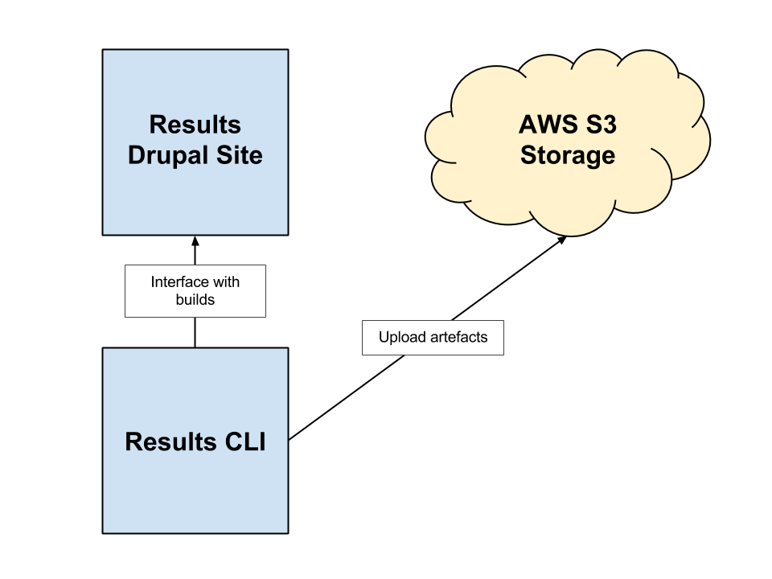

DrupalCI Results
================

## Overview

Build reporting for build projects.


## Diagram



## Build

**Credentials**

The following will setup your authentication to AWS.

```bash
$ export AWS_ACCESS_KEY='Super secret access key'
$ export AWS_SECRET_KEY='Super secret secret key'
```

**Standard build**

```bash
$ packer build packer/packer.json
```

**Build off a different base AMI**

```bash
$ packer build -var 'source_ami=ami-123456' packer/packer.json
```
